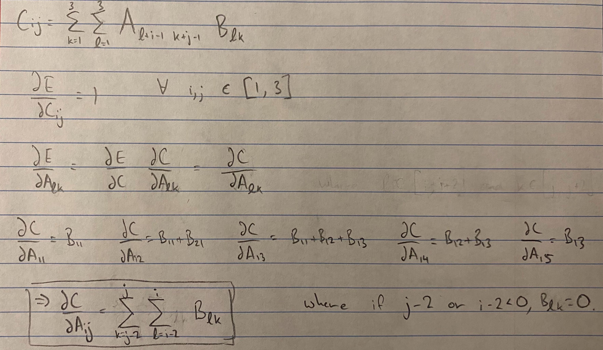

# 1.1 Convolution
### a

The equation to be used is:

n-f+1

Where n is the dimension of the matrix, f is the dimension of the filter, p is the padding, and s is the stride.
n = 5, and f = 3. Thus:

5-3+1 = 3.

This convolution will result in a 3x3 matrix.

### b

The full equation is:

(n-f+2p)/s + 1

Where p is the padding and s is the stride. Since p = 0 and s = 1, this results in the same equation as used above.

### c

We will take the inner product of B with each one of the following sub-matrices of A:

##### A1
| col1 | col2 | col3 |
| - | - | - |
| 4 | 5 | 2 |
| 3 | 3 | 2 |
| 4 | 3 | 4 |

##### A2
| col1 | col2 | col3 |
| - | - | - |
| 5 | 2 | 2 |
| 3 | 2 | 2 |
| 3 | 4 | 1 |

##### A3
| col1 | col2 | col3 |
| - | - | - |
| 2 | 2 | 1 |
| 2 | 2 | 4 |
| 4 | 1 | 1 |

##### A4
| col1 | col2 | col3 |
| - | - | - |
| 3 | 3 | 2 |
| 4 | 3 | 4 |
| 5 | 1 | 4 |

##### A5
| col1 | col2 | col3 |
| - | - | - |
| 3 | 2 | 2 |
| 3 | 4 | 1 |
| 1 | 4 | 1 |

##### A6
| col1 | col2 | col3 |
| - | - | - |
| 2 | 2 | 4 |
| 4 | 1 | 1 |
| 4 | 1 | 2 |

##### A7
| col1 | col2 | col3 |
| - | - | - |
| 4 | 3 | 4 |
| 5 | 1 | 4 |
| 5 | 1 | 3 |

##### A8
| col1 | col2 | col3 |
| - | - | - |
| 3 | 4 | 1 |
| 1 | 4 | 1 |
| 1 | 3 | 1 |

##### A9
| col1 | col2 | col3 |
| - | - | - |
| 4 | 1 | 1 |
| 4 | 1 | 2 |
| 3 | 1 | 4 |

This results in the matrix:

| col1 | col2 | col3 |
| - | - | - |
| 109 | 92 | 72 |
| 108 | 85 | 74 |
| 110 | 74 | 79 |

Where the first entry in the matrix is the inner product between B and A1, the second entry between between B and A2, etc.

### d

This results in the following matrix:

| col1 | col2 | col3 |
| - | - | - |
| 4 | 7 | 10 | 6 | 3 |
| 9 | 17 | 25 | 16 | 8 |
| 11 | 23 | 34 | 23 | 11 |
| 7 | 16 | 24 | 17 | 8 |
| 2 | 6 | 9 | 7 | 3 |
